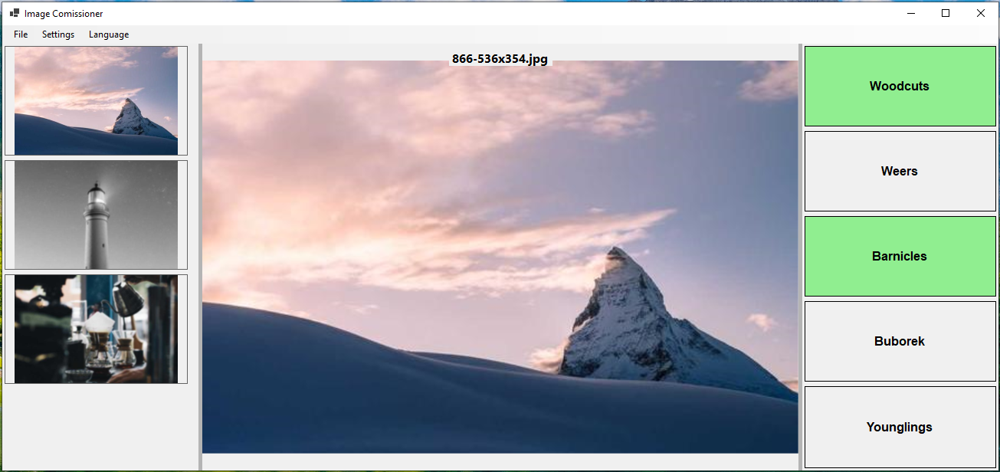

# Image Commissioner

A simple yet potent image management tool designed to help you **organize and export images efficiently**.

The power lies in the app's simplicity. It does a very specific task but it does that very efficiently. I made this to comission the huge mix of images taken on my wedding for the individuals / groups in a personalized manner.

## 🚀 Features

- **Select a Folder** – Choose a directory where your images are stored.
- **List All Images** – Automatically scans and displays all images in the selected folder.
- **Navigate Through Images** – Easily browse through your collection.
- **Define Labels** – Create custom groups to categorize your images.
- **Tag Images with your Labels** – Assign or remove tags for each image.
- **Export Tagged Images** – Save categorized images into folders named after their label.

## 📂 How It Works

1. **Select a folder** to load images.
2. **View and navigate** through the images.
3. **Create batch categories**.
4. **Tag images** with batch labels.
5. **Export** all tagged images to folders based on their batch name.
6. *(Optional)* **Compress** exported images into a ZIP

## Example



```
> tree
~destination\Barnicles\866-536x354.jpg
~destination\Barnicles\866-536x354_95.jpg
~destination\Barnicles\870-536x354-blur_2-grayscale.jpg
~destination\Weers\1060-536x354-blur_2.jpg
~destination\Weers\870-536x354-blur_2-grayscale.jpg
~destination\Weers\870-536x354-blur_2-grayscale_22.jpg
~destination\Woodcuts\866-536x354.jpg
~destination\Woodcuts\866-536x354_22.jpg
~destination\Woodcuts\870-536x354-blur_2-grayscale.jpg
~destination\Younglings\1060-536x354-blur_2.jpg
~destination\Younglings\1060-536x354-blur_2_56.jpg
```